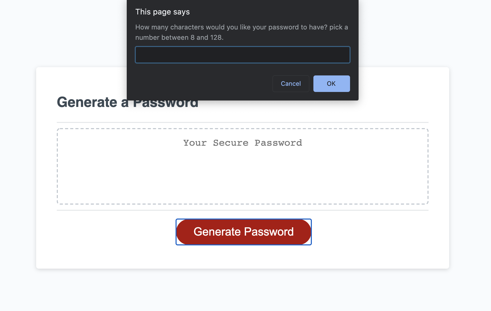

# random-password-generator-prompt

In this [project](https://goodlvn.github.io/random-password-generator-prompt/) we are prompted to create a random password generator that outputs a strong password that meets given criteria. The criteria/parameters of the random password are input through built in browser functions that communicate and interact with the user. We used functions such as prompts, confirms, and alerts to make sure the program recived the proper criteria; length of characters, lower case letters, upper case letters, numbers, and special characters all being options. 

## Screenshots of project 

starting screen - press button to initiate logic


prompt function - used to gather length of password


confirm function - used to select character criteria


generate password based on input criteria


## How to use: 

1. open in browser 
2. click "Generate Password" 
3. answer browser prompts
4. use generated password
5. for continued use; repeat steps 2-4 

## Technolgies used 
* Javascript
* HTML
* CSS

## Why does this project stand out?

What makes this project stand out from the past homework assignments we have turned in is the fact that we had to think about and create our own logic in order to get the desired out come. Although we were given a couple of guidlines (i.e. writePassword function title, generatePassword function title, and the event listener that links the button to the start of the function) we had to use a combination of built in javascript functions, small side functions that condense code, and good logic flow to make the code work. We also had an oportunity to look past the scope of what we have learned in class in order to improve our code!

### Side functions that condese code & Built in functions
```
function randomNumber(argument) {

  return Math.floor(Math.random() * argument);
}

function addValue(characterChoice){
  comboArray.push.apply(comboArray, characterChoice);
}
```

#### Use example ^
```
if(lowerCaseIsTrue) {

    ranumL = randomNumber(lowerCase.length);

    ranLower = lowerCase[ranumL];

    addValue(lowerCase);

}

if(upperCaseIsTrue) {

    ranumU = randomNumber(upperCase.length);

    ranUpper = upperCase[ranumU];

    addValue(upperCase);
}
```

### Going outside scope of class - regular expressions 

```
var numCheck = /^[0-9]+$/;

validInput = false;

while(!validInput){

    passwordLength = prompt("How many characters would you like your password to have? pick a number between 8 and 128.");

    if (passwordLength.match(numCheck) && 7 < passwordLength && passwordLength < 129){

      validInput = true;
      
    } else {

      passwordLength = 0;
      
      alert("Please input a number between 8 and 128");
    }
}
```
## Credits 

* [How to use regular expressions to accept only numbers](https://www.w3resource.com/javascript/form/all-numbers.php#:~:text=size%3A%2010pt%3B%20%7D-,To%20check%20for%20all%20numbers%20in%20a%20field,is%20the%20complete%20web%20document.)

* [How to pass data from one array into another](https://www.techiedelight.com/copy-elements-array-into-another-array-javascript/)

* Jennifer Henry - inspo for the lay out of logical flow of my code and the use of functions that condese repeated code

* Kevin Luo - helped me with one of my bugs (text was not clearin upon request of new password) by directing my focus to the scope of my variables 


